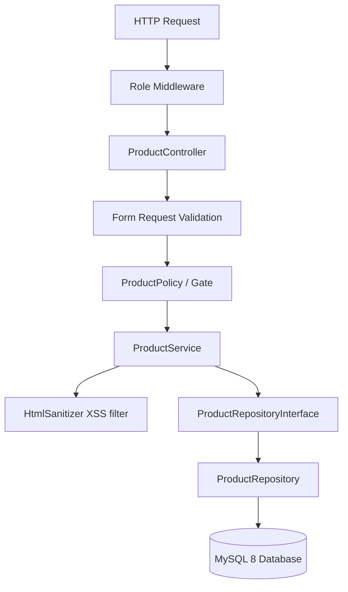

# Ekahal Test - Product Management System

An enterprise-grade, containerized Product Management catalog system built with Laravel 13, PHP 8.3, and MySQL 8. The application is styled with Bootstrap 5, integrated with the AdminLTE 4 dashboard framework, and powered by server-side AJAX DataTables.

---

## 1. Design Patterns & Architecture Decisions

This project is built using professional, decoupled architectural design patterns rather than basic Laravel MVC conventions.



### Key Architectural Decouplings:
1. **Repository Pattern**: Prevents controllers from directly interacting with Eloquent models. Interacting via `ProductRepositoryInterface` permits swapping out database mechanisms (e.g., Eloquent, raw SQL, or third-party APIs) without altering controller logic.
2. **Service Layer Pattern**: Business logic is encapsulated in `ProductService`. This keeps controllers extremely thin and focused solely on processing HTTP inputs and returning responses.
3. **Constructor-Based Dependency Injection**: Promotes testability by allowing mock services and repositories to be injected easily during testing.
4. **Form Request Validation**: Isolates validation constraints into dedicated class files (`StoreProductRequest`, `UpdateProductRequest`), separating validation concerns from business logic.
5. **Policy-Based Authorization**: Restricts route-level and query-level actions via model policies (`ProductPolicy`) mapped dynamically to the database roles.

---

## 2. Security & Performance Reviews

### Security Architectures:
*   **DOM-Based XSS Sanitization**: The `HtmlSanitizer` service parses HTML fields using the PHP DOMDocument wrapper to systematically strip away `<script>` elements, inline event handlers (e.g., `onclick`, `onload`), and unsafe protocol URI prefixes (e.g., `javascript:`, `data:`). This prevents injection vectors while preserving safe rich-text formatting (bold, lists, headings).
*   **SQL Injection Defense**: The system prevents SQL injection by utilizing Eloquent's parameterized binding for all repository query executions.
*   **Cross-Site Request Forgery (CSRF)**: CSRF middleware is enabled globally; all dashboard mutations (POST, PUT, DELETE) require a cryptographically signed token.
*   **Granular Role-Based Access Control (RBAC)**: Custom route middleware (`EnsureUserHasRole`) and Policies (`ProductPolicy`) form a dual-layered security gate. Even if write buttons are physically hidden in the UI from standard users, any direct routing attempts to API endpoints will immediately result in a `403 Action Unauthorized` response.

### Performance Architectures:
*   **Server-Side AJAX DataTables**: All pagination, sorting, and search filtering are offloaded to the database via AJAX limits and offsets. This maintains a light DOM structure, preventing browser rendering lags even when catalog items scale into the millions.
*   **Indexed DB Queries**: Database columns utilized in sorting, searching, and indexes (`title`, `price`, and `date_available`) are indexed on the database level to ensure query execution speeds remain sub-millisecond.
*   **Lazy Loading Safety Check**: Developer N+1 query loops are prevented in local staging environments by enforcing strict model hydration requirements (`Model::shouldBeStrict()`).

---

## 3. Challenges & Technical Solutions (Handling Edge Cases)

During development, we resolved several critical edge cases to ensure standard compliance:

| Technical Challenge | Root Cause | Selected Solution |
| :--- | :--- | :--- |
| **Route Precedence Collision** | Placing wildcard route mappings (e.g., `/products/{product}`) above static sub-routes (e.g., `/products/create`) causes the router to try to bind `"create"` as a model instance, triggering 404 errors. | Restructured `web.php` to define specific static routes first, placing wildcards at the bottom. |
| **Vite Manifest Exceptions** | Automated feature tests run without compiled public assets, which triggers asset manifest errors when Laravel attempts to boot Vite scripts. | Configured `TestCase.php` to execute `withoutVite()` hooks on start during automated test suite runs. |
| **Dark Mode Contrast Clash** | AdminLTE automatically switches elements to dark mode based on browser queries. Hardcoded visual helper classes (like `bg-white` or `text-dark`) caused light backgrounds to persist, leading to white text on white backgrounds. | Replaced all hardcoded background/color classes with semantic, theme-adaptive Bootstrap 5 variables (like `bg-body` or `text-body`). |
| **TinyMCE Validation Outline** | Standard form validation classes (`is-invalid`) are applied to hidden textareas, rendering them invisible. Users could submit form errors without seeing a red border around the active TinyMCE frame. | Added a Blade compiler helper that injects invalid outline style rules targeting the parent `.tox-tinymce` selector when the field has errors. |
| **Multi-Part Date Searches** | Users want to type arbitrary inputs like `"07"` (matching July month OR day 7), `"22"` (matching day 22), or `"2026"` (matching year 2026) in a single search bar. | Added numeric segment evaluation in the query builder using combination rules (`orWhereDay`, `orWhereMonth`, `orWhereYear`) along with standard text matching. |

---

## 4. Folder Structure Overview

```
app/
├── Http/
│   ├── Controllers/
│   │   └── ProductController.php      # AJAX / HTML resource controller
│   ├── Middleware/
│   │   └── EnsureUserHasRole.php      # Enforces route-level roles
│   └── Requests/
│       ├── StoreProductRequest.php     # Strict inputs validation
│       └── UpdateProductRequest.php
├── Models/
│   └── Product.php                    # Casts attributes & safety fillables
├── Policies/
│   └── ProductPolicy.php              # Authorization logic mapping
├── Providers/
│   └── RepositoryServiceProvider.php  # Binds Repository Contracts -> Implementations
├── Repositories/
│   ├── Contracts/
│   │   └── ProductRepositoryInterface.php
│   └── ProductRepository.php          # Database search and pagination queries
└── Services/
    ├── HtmlSanitizer.php              # DOM-based rich text security filter
    └── ProductService.php             # Integrates Sanitizer & Repositories
```

---

## 5. Installation, Seeding & Credentials

### Setup Steps
1. Build and run container layers:
   ```bash
   docker compose up --build -d
   ```
2. Trigger the automated deployment script to run dependency install, database migrations, seeding, and compiler optimizations:
   ```bash
   ./deploy.sh
   ```
   *Alternative: use the `make deploy` shortcut.*

### Seeded Credentials
The database seeding process creates standard logins and **12 iconic Indian consumer products**:

| User Type | Email | Password | Role |
| :--- | :--- | :--- | :--- |
| **Admin** | `admin@example.com` | `password` | admin (Full CRUD) |
| **Standard User** | `user@example.com` | `password` | standard (Read-Only) |

---

## 6. Future Scale-Up Improvements

If this were developed into a large-scale SaaS product, we would add:
1.  **Elasticsearch / Algolia Integration**: Offload database search queries to a dedicated search cluster to handle typos, synonym matching, and complex query weightings.
2.  **Redis Cache Layer**: Cache product details and index responses to prevent database hits for high-traffic public catalog viewing.
3.  **Tenant Isolation (Multi-Tenancy)**: Implement scoping (via foreign keys or database-per-tenant patterns) to securely segregate catalog ownership across multiple corporate subscribers.
4.  **Amazon S3 Storage**: Store uploaded product images securely in cloud buckets using CDN distribution (Amazon CloudFront) to speed up image rendering.
5.  **Job Queues**: Use Redis queues to process background events, such as emailing reports to users, optimizing image sizes, and executing webhooks.
